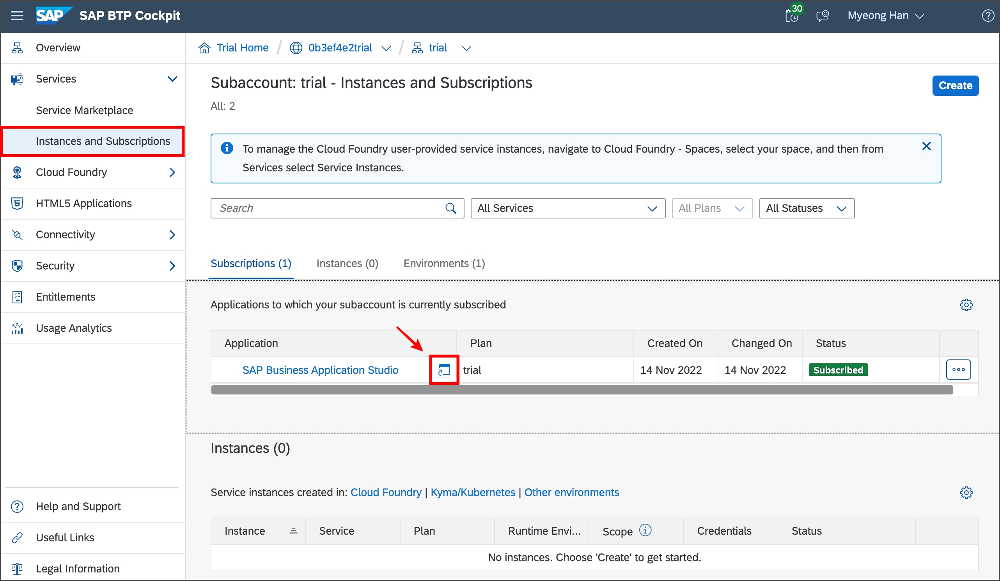

# **SAP BTP Trial Tutoiral_221119** 

> 이 튜토리얼은 SAP BTP에서 개발을 시작하는 개발자를 위한 가이드입니다. 플랫폼 기본 사항에 대해 알아보고, Trial 계정에 등록하고, App을 배포합니다. 

## 1. Login SAP BTP

1. [https://account.hana.ondemand.com](https://account.hana.ondemand.com/#/home/welcome) 로 이동하여 SAP BTP cockpit에 로그인(Sign In)합니다.
2. SAP BTP Trial 계정이 없다면 `Register`를 통해 회원가입을 진행합니다.


## 2. **Create Global Account** 

1. 로그인 후 Region을 선택하는 화면이 나타나면 **US East(VA)- AWS** **>** **Create Account** 를 선택


2. Account 생성이 완료되면, 아래와 같이 Global Account, Subaccount, Org, Space가 자동으로 생성됩니다.
3. **Continue**를 선택합니다.


4. **Go To Your Trial Account**를 선택합니다.


5. Global Account는Subaccount, 구성원(members), 권한(entitlements) 및 할당량(quotas)을 관리하는 데 사용됩니다. 
Global Account 별로 플랫폼 리소스를 사용할 수 있는 권한(entitlements) 및 할당량(quotas) 을 받은 다음 실제 사용을 위해 권한(entitlements) 및 할당량(quotas) 을 Subccount에 배포합니다.


6. SAP BTP Trial Global Account 화면입니다. 이 화면에서 Global Account의 설정이 가능합니다.
7. Subaccount 목록에서 방금 전 생성된 trial을 선택합니다.


8. SAP BTP Trial Subaccount 화면입니다. 이 화면에서 Subaccount의 설정이 가능합니다.
9. Overview 페이지에서 Subaccount의 기본 정보들을 확인할 수 있습니다.

## **3. Subaccount**


1. Tiral Global Account가 자동 생성될 경우, Booster를 통해 자동으로 Business Application Studio가 Subscription 됩니다.
2. **Services > Instance and Subscription > SAP Business Application Studio** 선택

## **4. SAP Business Application Studio**




1. **Create Dev Space** 선택


2. Additional SAP Extensions 에서 아래의 목록을 선택합니다.
	- CAP Tools
	- HTML5 Application Template
	- Launchpad Module
	- Basic UI5 Template
	- SAP Business Application Studio Extension Development
3. Space의 이름을 입력하고 **Create Dev Space** 선택


4. 이제 BAS의 Space가 생성되기 시작하고, RUNNING 상태가 되면 Space Name을 선택


## **5. Create Application**

> SAPUI5 Application을 생성하고 배포합니다.

### MTA(Multitarget Applications)
논리적으로 동일한 Life-Cycle을 공유하는 서로 다른 기술로 생성된 여러 모듈/리소스로 구성된 단일 응용 프로그램입니다.

개발자는 MTA 모듈, MTA 리소스 및 이들 간의 상호 종속성을 포함하는 MTA 모델을 사용하여 Cloud Foundry 환경으로 배포를 검증, 자동화합니다. 


### 1) Create MTA Application

> 가장 최상단인 MTA Application을 먼저 생성합니다.

1. **Start from template** 선택


2. **Basic Multitenant Application** 선택 > **Start** 선택


3. **MTA Project명 입력** > **Finish** 선택

   | Property     | Value    |
   | ------------ | -------- |
   | project name | mta-hkmc |


### 2) Create SAPUI5 Application
> MTA Application에 SAPUI5 Application을 생성합니다.

1. **Start from template** 선택


2. **SAP Fiori Application** 선택 > **Start** 선택


3. **Application Type: SAPUI5 freestyle** 선택 > **SAPUI5 Application** >  **Next** 선택


4. **Data Source: None** 선택 > **SAPUI5 Application** >  **Next** 선택


5. **View Name: App 입력** > **Next** 선택

   | Property  | Value |
   | --------- | ----- |
   | View name | App   |


6. 아래와 같이 프로젝트 정보를 입력 > **Next** 선택

   | Property              | Value          |
   | --------------------- | -------------- |
   | Module name           | ztmp_001       |
   | Application namespace | com.hkmc.trial |


7. 아래와 같이 프로젝트 정보를 입력 > **Next** 선택

   | Property         | Value         |
   | ---------------- | ------------- |
   | target           | Cloud Foundry |
   | Destination name | None          |


### 3) Create Approuter
> MTA Application에 SAP Approuter를 생성합니다.
>
> #### SAP Approuter
>
> Application이 여러 개의 서로 다른 앱(마이크로서비스)으로 구성된 경우 Application Router는 해당 Application에 대한 단일 진입점(Single entry point)을 제공하는 데 Nodejs 기반의 라이브러리입니다.
>
> #### SAP Approuter를 사용할 수 있는 환경
>
> - SAP CF – Cloud Foundry
> - SAP XSA – XS Advanced (On Premise)
> - Local environment
>
> #### 주요기능
>
> - Dispatching of requests to other microservices
> - Authentication
> - Authorization check
> - Complete integration with Destination service
> - Complete integration with HTML5 Application repository
> - Complete integration with Business Services

1. **Show all commands(Ctrl + Shift + P)** > **Open Template Wizard** 선택


2. **Approuter Configuration 선택** > **Next** 선택


3. **Prejoect Location을 mta-hkmc 프로젝트 경로로 선택** > **Next** 선택


4. 아래와 같이 프로젝트 정보를 설정 > **Next** 선택

   | Property            | Value                |
   | ------------------- | -------------------- |
   | Application Runtime | Standalone Approuter |
   | authentication      | No                   |
   | add UI              | Yes                  |


5. 최종적인 프로젝트 구조는 아래와 같습니다.


## 6. Application Configuration

> 앱을 실행하기 전에 우선적으로 설정해줘야하는 내역을 설명합니다.

### 1) SAPUI5 Configuration

- **xs-app.json**

  > 어떤 요청을 어떤 목적지로 전달해야 하는지 결정하는 규칙을 `routes`라고 합니다. routing을 정의하려면 xs-app.json 파일을 구성해야 합니다.
  >
  > SAPUI5 Application의 xs-app.json 파일을 열고 아래와 같이 수정합니다.
  >
  > 경로: /mta-hkmc/ztmp_001/**xs-app.json**
  >
  > ```yml
  > {
  >    	"welcomeFile": "/index.html",
  >    	"authenticationMethod": "none",
  >   	"routes": [
  >        {
  >          "source": "^(.*)$",
  >          "target": "$1",
  >          "service": "html5-apps-repo-rt",
  >          "authenticationType": "xsuaa"
  >        }
  >   	]
  > }
  > ```

- **index.html**
  
  > SAPUI5 Application을 실행하는 파일입니다.
  >
  > SAPUI5 Application의 index.html 파일을 열고 아래와 같이 수정합니다.
  >
  > 경로: /mta-hkmc/ztmp_001/webapp/**index.html**
  >
  > | Property                 | Value                                                     |
  > | ------------------------ | --------------------------------------------------------- |
  > | src                      | https://sapui5.hana.ondemand.com/resources/sap-ui-core.js |
  > | data-sap-ui-frameOptions | allow                                                     |
  >
  > ```html
  > <!DOCTYPE html>
  > <html lang="en">
  > <head>
  >     <meta charset="UTF-8">
  >     <meta name="viewport" content="width=device-width, initial-scale=1.0">
  >     <meta http-equiv="X-UA-Compatible" content="IE=edge">
  >     <title>temp application</title>
  >     <style>
  >         html, body, body > div, #container, #container-uiarea {
  >             height: 100%;
  >         }
  >     </style>
  >     <script
  >         id="sap-ui-bootstrap"
  >         src="https://sapui5.hana.ondemand.com/resources/sap-ui-core.js"
  >         data-sap-ui-theme="sap_horizon"
  >         data-sap-ui-resourceroots='{
  >             "com.hkmc.trial.ztmp001": "./"
  >         }'
  >         data-sap-ui-compatVersion="edge"
  >         data-sap-ui-async="true"
  >         data-sap-ui-frameOptions="allow"
  >     ></script>
  >     <script id="locate-reuse-libs" src="./utils/locate-reuse-libs.js"
  >         data-sap-ui-manifest-uri="./manifest.json"
  >         data-sap-ui-componentName="com.hkmc.trial.ztmp001">
  >     </script> 
  > </head>
  > <body class="sapUiBody sapUiSizeCompact" id="content">
  >     <div
  >         data-sap-ui-component
  >         data-name="com.hkmc.trial.ztmp001"
  >         data-id="container"
  >         data-settings='{"id" : "com.hkmc.trial.ztmp001"}'
  >         data-handle-validation="true"
  >     ></div>
  > </body>
  > </html>
  > ```

### 2) SAP Approuter

> 기본적으로 제공해주는 Default Approuter 구성이 있습니다.
>
> 하지만 Default Approuter 구성을 이용하기에는 기능적으로 한계가 있으므로, Customizing된 Approuter를 구성합니다. 
>
> **mta-hkmc/mta-hkmc-approuter/**
>
> 
>
> 먼저 위의 경로에서 **터미널(Ctrl + Shift + `)** 을 열고 아래의 명령어를 입력 **cfenv** 모듈을 설치합니다.
>
> ```bash
> npm i cfenv
> ```
>
> 위의 경로에서 index.js 파일을 생성합니다.
>
> #### **index.js** 
>
> ```javascript
> const approuter = require('@sap/approuter');
> const cfenv = require('cfenv');
> 
> const getConfigPath = () => {
> 	try {
> 		const { isLocal } = cfenv.getAppEnv();
> 		const options = { xsappConfig: null, destinations: null };
> 		if (isLocal) {
> 			console.log(`실행환경: localhost`);
> 			options.xsappConfig = require("./xs-app-local.json");
> 		} else {
> 			console.log(`실행환경: cloud foundry`);
> 			options.xsappConfig = require("./xs-app.json");
> 		}
> 		return options;
> 	} catch (error) {
> 		return error;
> 	}
> };
> 
> try {
> 	const { xsappConfig, destinations } = getConfigPath();
> 	const { isLocal, ['app']: appEnv } = cfenv.getAppEnv();
> 	const env = isLocal ? 'localhost' : appEnv.space_name === 'prd' ? appEnv.space_name : 			
> appEnv.application_name.split('-').reverse()[0];
> 	const port = process.env.PORT || 5000;
> 	const ar = approuter();
> 	ar.start({ port: port, xsappConfig }, () => {
> 		console.log('start approuter');
> 	});
> } catch (error) {
> 	console.log(error);
> }
> ```
>
> 다음으로 package.json을 수정합니다.
>
> **package.json** 
>
> ```Json
> {
> 	"name": "approuter",
> 	"description": "Node.js based application router service for html5-apps",
> 	"dependencies": {
> 		"@sap/approuter": "10.5.1",
> 		"cfenv": "^1.2.4"
> 	},
> 	"devDependencies": {
> 		"@sap/html5-repo-mock": "2.1.0"
> 	},
> 	"scripts": {
> 		"start": "node .",
> 		"start-local": "node node_modules/@sap/html5-repo-mock/index.js"
> 	}
> }
> ```
>
> 
>
> 다음으로approuter 경로에서 두개의 파일을 생성합니다.
>
> #### **xs-app.json** 
>
> > 이 파일은 배포된 후 Cloud Foundry에서 사용되는 routes 설정 파일입니다.
>
> ```yml
> {
>   "welcomeFile": "comhkmctrialztmp001/index.html",
>   "authenticationMethod": "none",
>   "routes": [
>     {
>       "source": "^/comhkmctrialztmp001/(.*)$",
>       "target": "$1",
>       "localDir": "../ztmp_001/webapp"
>     }
>   ]
> }
> ```
>
> 
>
> #### **xs-app-local.json** 
>
> > 이 파일은 로컬 환경에서에서 사용되는 routes 설정 파일입니다.
> ```yml
> {
>   "welcomeFile": "comhkmctrialztmp001/index.html",
>   "authenticationMethod": "none",
>   "routes": []
> }
> ```
> > #### **참고**
> >
> > **welcomeFile**은 Application이 최초 실행시 route 경로입니다. local환경에서는 localDir에서 직접 접근을 하며, 배포 환경인 Cloud foundry에서는 html5 repository runtime 서비스를 사용하게 됩니다. welcomeFile namespace는 SAPUI5의 Application의 `app id`를 사용합니다. 해당 내용은 SAPUI5 Application의 `manifest.json`에서 확인할 수 있습니다.
> >
> > ```json
> > {
> >   ...
> >   "sap.app": {
> >     "id": "com.hkmc.trial.ztmp001",
> >     ...
> >   }
> >   ...
> > }
> > ```

### 3) MTA Application

> mta.yaml은 배포 자동화와 관련된 내용을 정의합니다.
>
> 
>
> **mta.yaml > Open With... > Text Editor**
>
> 아래와 같이 mta.yaml을 작성합니다.
>
> #### mta.yaml
>
> ```yml
> _schema-version: "3.2"
> ID: mta-hkmc
> version: 0.0.1
> modules:
> - name: mta-hkmc-app-content
>   type: com.sap.application.content
>   path: .
>   requires:
>   - name: mta-hkmc-repo-host
>     parameters:
>       content-target: true
>   build-parameters:
>     build-result: resources
>     requires:
>     - artifacts:
>       - comhkmctrialztmp001.zip
>       name: comhkmctrialztmp001
>       target-path: resources/
> - name: comhkmctrialztmp001
>   type: html5
>   path: ztmp_001
>   build-parameters:
>     build-result: dist
>     builder: custom
>     commands:
>     - npm install
>     - npm run build:cf
>     supported-platforms: []
> - name: mta-hkmc-approuter
>   type: approuter.nodejs
>   path: mta-hkmc-approuter
>   requires:
>   - name: mta-hkmc_html_repo_runtime
>   parameters:
>     disk-quota: 256M
>     memory: 256M
> resources:
> - name: mta-hkmc-repo-host
>   type: org.cloudfoundry.managed-service
>   parameters:
>     service: html5-apps-repo
>     service-plan: app-host
> - name: mta-hkmc_html_repo_runtime
>   type: org.cloudfoundry.managed-service
>   parameters:
>     service: html5-apps-repo
>     service-plan: app-runtime
> parameters:
>   deploy_mode: html5-repo
> ```
>


## 7. Run Application

SAP Approuter 경로

**/mta-hkmc/mta-hkmc-approuter/**

해당 경로에서 **터미널(Ctrl + Shit + `)**을 열고 아래의 명령어를 통해 Application을 실행합니다.

```bash
npm start
```


오른쪽 아래의 **Open in a New Tab**을 통해 실행된 Application 미리보기가 가능합니다.

만약 위와 같이 오른쪽 아래에 탭이 나타나지 않을 경우, **Show all commands(Ctrl + Shift + P)** > **Ports: Preview** 를 통해 실행된 Application을 미리보기 할 수 있습니다.


## 8. Deploy Cloud Foundry

> mta.yaml에 설정된 배포 정의를 통해 Cloud Foundry에 배포를 자동으로 수행합니다.

### 1) Login Cloud Foundry

> 배포(deploy)를 하기 위해 배포 Target 으로 로그인합니다.
>
> **/mta-hkmc**
>
> 해당 경로에서 **터미널(Ctrl + Shit + `)**을 열고 아래의 **cf cli** 명령어를 통해 로그인을 진행합니다.

```
cf l -a https://api.cf.us10-001.hana.ondemand.com
```


### 2) Build MTA

> MTA를 배포하기 위해서는 빌드를 우선적으로 수행해야 합니다. Build를 진행합니다.
>
> **/mta-hkmc**
>
> 해당 경로에서 **터미널(Ctrl + Shit + `)**을 열고 아래의 명령어를 통해 빌드를 진행합니다.
> 빌드가 완료되면 archive 폴더에 필드된 mtar 파일이 생성되고, 터미널에 해당 파일의 경로가 출력됩니다. 해당 경로를 더블클릭해 복사(Ctrl+C)합니다.

```bash
mbt build
```


### 3) Deploy MTA

> 위에서 복사한 mtar 파일의 경로를 이용해 
> **터미널(Ctrl + Shit + `)**을 열고 아래의 명령어를 통해 빌드를 진행합니다.

```bash
#cf deploy <file path>
cf deploy /home/user/projects/mta-hkmc/mta_archives/mta-hkmc_0.0.1.mtar
```


배포가 완료된 URL을 통해 배포된 Application에 접속하면 아래와 같이 SAPUI5 Application이 나타나는것을 확인할 수 있습니다.


여기까지 SAP BTP Trial에 대한 기본적인 개발 방법 및 배포 방법에 대해 알아보았습니다.

해당 상세 소스는 아래의 git를 통해 확인하실 수 있습니다.

#### https://github.com/rendez0829/mta-hkmc-trial/