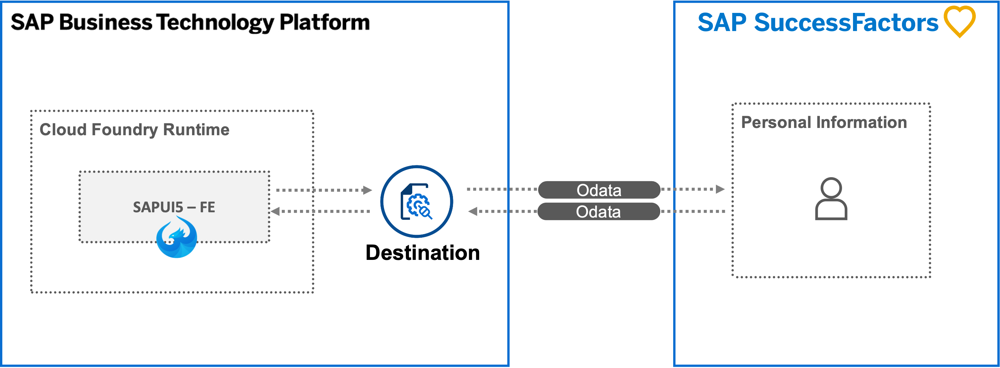
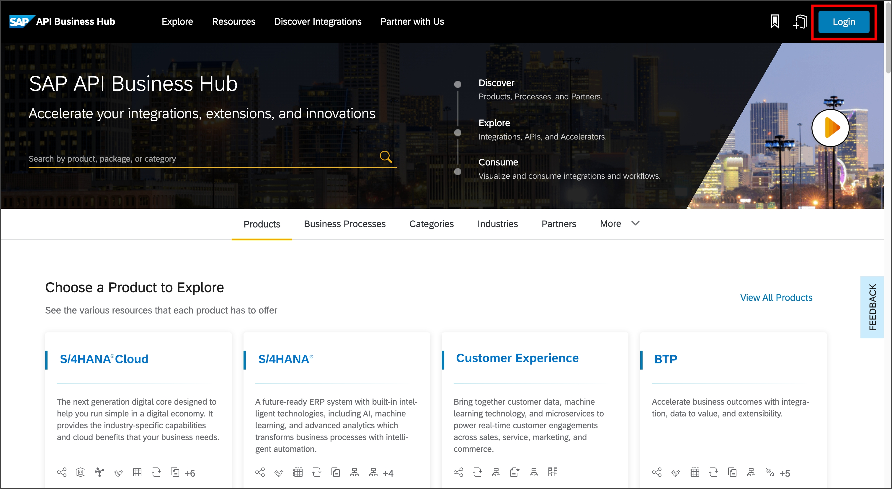
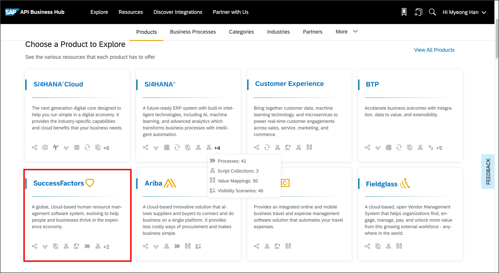
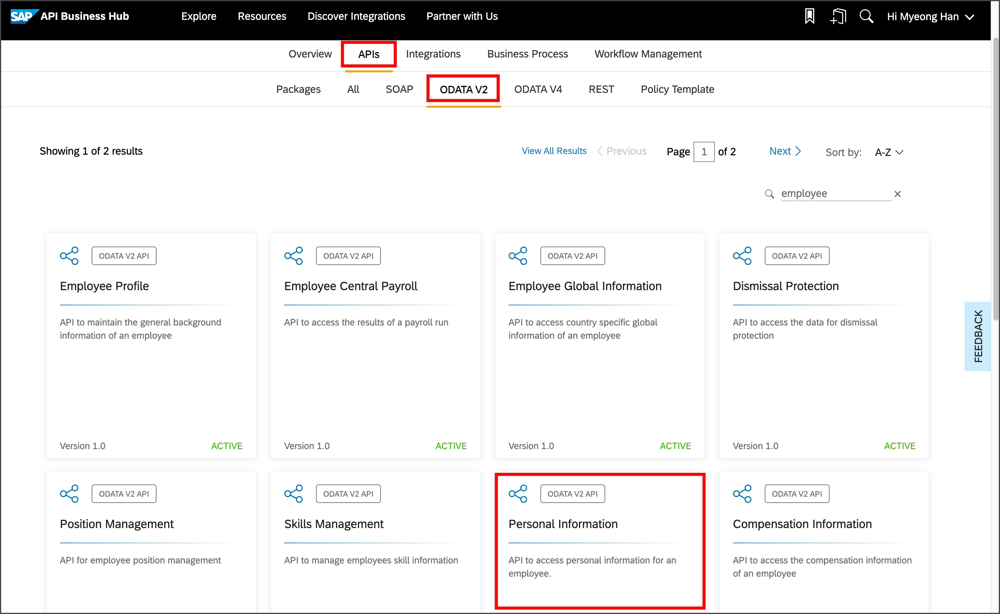
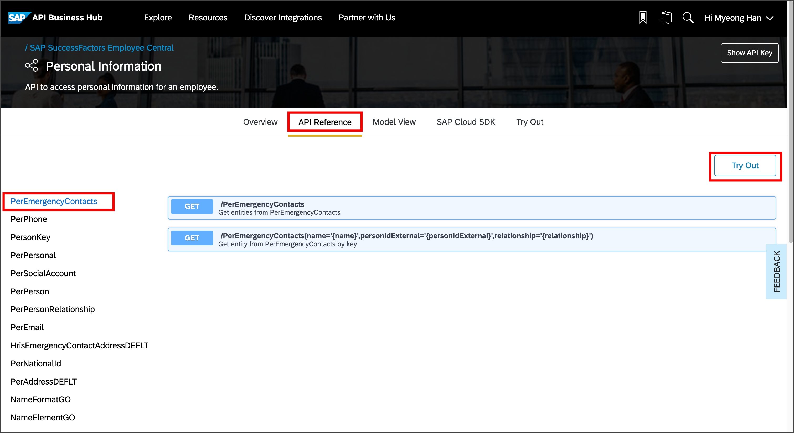
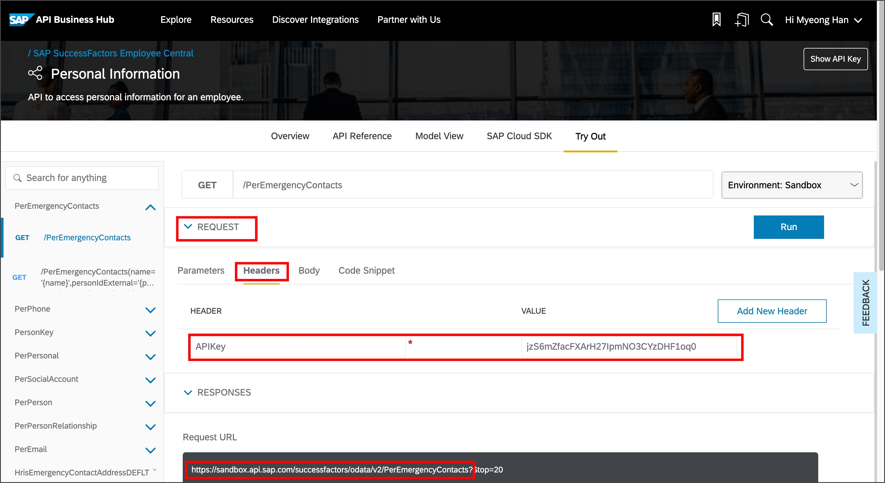
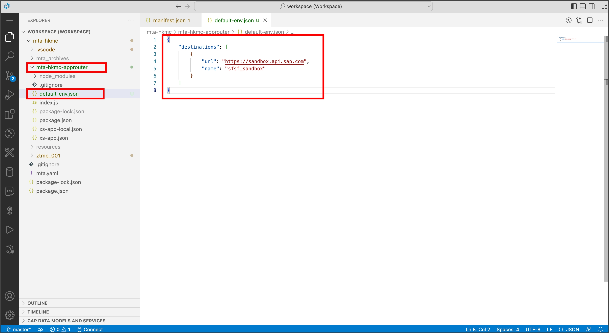
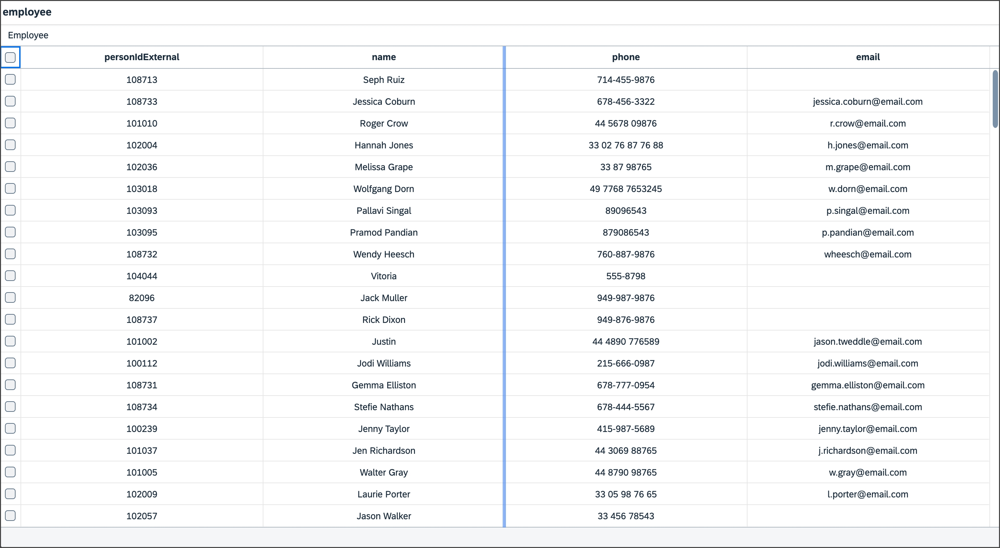

# **SAP BTP SFSF Extension Tutotial_221119** 

> 이 튜토리얼은 SAP BTP에서 SAP SuccessFactors Side-by-Side Extension 개발 방법을 설명합니다.
>
> 해당 프로젝트는 BTP Tutorial의 mta-hkmc를 기반으로 합니다.

## 1. Architecture Overview
다음은 애플리케이션의 전체 아키텍처를 나타내는 다이어그램입니다.

Destination 사용하여 SAP SuccessFactors에서 기본 직원(SF 사용자) API를 통해 정보를 읽고 직원의 엔터티를 이용하는 Application입니다.



## 2. Login SAP API Business Hub

1. [https://api.sap.com](https://api.sap.com) 로 이동하여 SAP API Business Hub에 로그인 합니다.




## 3. Success Factors API 목록 확인

1. 아래의 목록에서 **SuccessFactors** 선택



2. **APIs > ODATA V2 > Personal Infomation**




3. **API Reference > PerEmergencyContacts > Try Out**



3. **Run > API Response를 확인**

> **REQUEST > Headers **
>
> APIKey : <apikey> 
>
> **URL** : GET https://sandbox.api.sap.com/successfactors/odata/v2/PerEmergencyContacts
>
> URL에서 Host와 Resource URI를 분리합니다.
>
> | Host             | https://sandbox.api.sap.com                   |
> | ---------------- | --------------------------------------------- |
> | **Resource URI** | /successfactors/odata/v2/PerEmergencyContacts |




## 4. Application Configuration

> 앱을 실행하기 전에 우선적으로 설정해줘야하는 내역을 설명합니다.

### 1) Approuter Configuration

4. 이제 이전 튜토리얼에서 생성해둔 mta-hkmc 프로젝트로 이동하여 Approuter Destination을 작성합니다.
> #### SAP Approuter
>
> Application이 여러 개의 서로 다른 앱(마이크로서비스)으로 구성된 경우 Application Router는 해당 Application에 대한 단일 진입점(Single entry point)을 제공하는 데 Nodejs 기반의 라이브러리입니다.
>
> #### SAP Approuter를 사용할 수 있는 환경
>
> - SAP CF – Cloud Foundry
> - SAP XSA – XS Advanced (On Premise)
> - Local environment
>
> #### 주요기능
>
> - Dispatching of requests to other microservices
> - Authentication
> - Authorization check
> - Complete integration with Destination service
> - Complete integration with HTML5 Application repository
> - Complete integration with Business Services

5. **/mta-hkmc/mta-hkmc-approuter** 경로에서 **default-env.json** 파일을 생성하여 destination을 작성합니다. url을 호출시 name으로 대체하여 url을 호출합니다.

#### default-env.json
```json
{
    "destinations": [
        {
            "url": "https://sandbox.api.sap.com",
            "name": "sfsf_sandbox"
        }
    ]
}
```




6. **/mta-hkmc/mta-hkmc-approuter** 경로에서 **xs-app.json**과 **xs-app-local.jso** 파일을 수정합니다.

#### xs-app.json

```json
{
  "welcomeFile": "comhkmctrialztmp001/index.html",
  "authenticationMethod": "none",
  "routes": [
    {
      "source": "^/sfsf_sandbox/(.*)$",
      "target": "$1",
      "destination": "sfsf_sandbox",
      "csrfProtection": false
    }
  ]
}
```


#### xs-app-local.json

```json
{
    "welcomeFile": "comhkmctrialztmp001/index.html",
    "authenticationMethod": "none",
    "routes": [
      {
        "source": "^/comhkmctrialztmp001/(.*)$",
        "target": "$1",
        "localDir": "../ztmp_001/webapp"
      },
      {
        "source": "^/sfsf_sandbox/(.*)$",
        "target": "$1",
        "destination": "sfsf_sandbox",
        "csrfProtection": false
      }
    ]
  }
```


### 2) SAPUI5 Configuration

**/mta-hkmc/ztmp_001/webapp** 경로에서 manifest.json의 routing 설정을 변경합니다.

#### manifest.json

```Json
{
  ...
    "routing": {
      "config": {
        "routerClass": "sap.m.routing.Router",
        "viewType": "XML",
        "async": true,
        "viewPath": "com.hkmc.trial.ztmp001.view",
        "controlAggregation": "pages",
        "controlId": "app",
        "clearControlAggregation": false
      },
      "routes": [
        { "name": "MAIN", "pattern": "", "target": ["MAIN"] }
      ],
      "targets": {
        "MAIN": { "viewType": "XML", "viewName": "Main", "viewId": "Main" }
      }
    }
	...
  }
}

```


**/mta-hkmc/ztmp_001/webapp/controller** 경로에서 main.controller.js 파일을 생성합니다.

#### main.controller.js

```javascript
sap.ui.define([
    "sap/ui/core/mvc/Controller",
    "sap/ui/model/json/JSONModel",
],
    /**
     * @param {typeof sap.ui.core.mvc.Controller} Controller
     */
    function (Controller, JSONModel) {
        "use strict";

        return Controller.extend("com.hkmc.trial.ztmp001.controller.Main", {
            onInit: function () {
            }
        });
    });

```

**/mta-hkmc/ztmp_001/webapp/view** 경로에서 app.view.xml 파일을 수정합니다.

#### app.view.xml

```xml
<mvc:View 
    controllerName="com.hkmc.trial.ztmp001.controller.App" 
    xmlns:mvc="sap.ui.core.mvc" 
    xmlns:ui="sap.ui.table" 
    displayBlock="true" 
    xmlns="sap.m" >
    <App id="app"/>
</mvc:View>
```

**/mta-hkmc/ztmp_001/webapp/view** 경로에서 main.view.xml 파일을 생성합니다.

#### main.view.xml

```xml
<mvc:View 
    controllerName="com.hkmc.trial.ztmp001.controller.Main" 
    xmlns:mvc="sap.ui.core.mvc" 
    xmlns:ui="sap.ui.table" 
    displayBlock="true" 
    xmlns="sap.m" >
    <Page title="employee">
        <content>
        </content>
    </Page>
</mvc:View>
```


## 5. SAPUI5 Application 작성
> 이제 SFSF API를 호출해 SAPUI5 Table Component에 데이터를 바인딩해서 출력해보겠습니다.

**/mta-hkmc/ztmp_001/webapp/controller** 경로에서 main.controller.js 파일을 수정합니다.

#### main.controller.js

```javascript
sap.ui.define([
    "sap/ui/core/mvc/Controller",
    "sap/ui/model/json/JSONModel",
],
    /**
     * @param {typeof sap.ui.core.mvc.Controller} Controller
     */
    function (Controller, JSONModel) {
        "use strict";

        return Controller.extend("com.hkmc.trial.ztmp001.controller.Main", {
            onInit: function () {
                this._getEmployeeInfo();
            },

            _getEmployeeInfo: function() {
                var view = this.getView();
                var options = {
                    url: "/sfsf_sandbox/successfactors/odata/v2/PerEmergencyContacts",
                    method: "get",
                    headers: {
                        "APIKey": "jzS6mZfacFXArH27IpmNO3CYzDHF1oq0",
                        "Accept": "application/json"
                    }
                }
                $.ajax(options).then(function(res) {
                    view.setModel(new JSONModel(res.d.results), "PerEmergencyContacts");
                });
            }
        });
    });

```

> ajax 호출을 통해 API 호출합니다. URL 호출에 Destination에서 설정한 name으로 호출시 Destination에 설정된 url을 호출하게 됩니다.
>
> 호출이 정상적으로 된 경우, view에 모델을 바인딩합니다. 

**/mta-hkmc/ztmp_001/webapp/view** 경로에서 main.view.xml 파일을 수정합니다.

#### main.view.xml

```xml
<mvc:View 
    controllerName="com.hkmc.trial.ztmp001.controller.Main" 
    xmlns:mvc="sap.ui.core.mvc" 
    xmlns:ui="sap.ui.table" 
    displayBlock="true" 
    xmlns="sap.m" >
    <Page title="employee">
        <content>
            <ui:Table 
                id="id-tableTxwa" 
                minAutoRowCount="10" 
                visibleRowCount="10" 
                visibleRowCountMode="Auto" 
                rows="{
                    path: 'PerEmergencyContacts>/',
                    sorter: [],
                    templateShareable : false
                }" selectionMode="MultiToggle" ariaLabelledBy="title">
                <ui:extension>
                    <OverflowToolbar>
                        <Text text="Employee"/>
                    </OverflowToolbar>
                </ui:extension>
                <ui:columns>
                    <ui:Column hAlign="Center" autoResizable="true">
                        <Label text="personIdExternal" />
                        <ui:template>
                            <Text text="{PerEmergencyContacts>personIdExternal}"/>
                        </ui:template>
                    </ui:Column>
                    <ui:Column hAlign="Center" autoResizable="true">
                        <Label text="name" />
                        <ui:template>
                            <Text text="{PerEmergencyContacts>name}"/>
                        </ui:template>
                    </ui:Column>
                    <ui:Column hAlign="Center" autoResizable="true">
                        <Label text="phone" />
                        <ui:template>
                            <Text text="{PerEmergencyContacts>phone}"/>
                        </ui:template>
                    </ui:Column>
                    <ui:Column hAlign="Center" autoResizable="true">
                        <Label text="email" />
                        <ui:template>
                            <Text text="{PerEmergencyContacts>email}"/>
                        </ui:template>
                    </ui:Column>
                </ui:columns>
            </ui:Table>
        </content>
    </Page>
</mvc:View>
```

## 최종 결과



여기까지 SAP SFSF API통한 Side-by-Side Extension에 대한 기본적인 개발 방법에 알아봤습니다.

해당 상세 소스는 아래의 git를 통해 확인하실 수 있습니다.

#### https://github.com/rendez0829/mta-hkmc-sfsf-trial