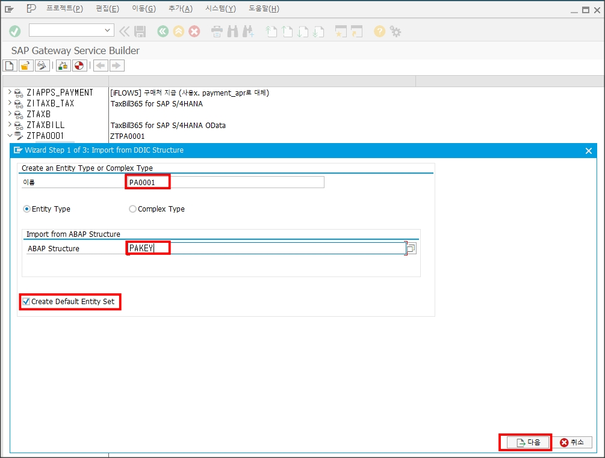
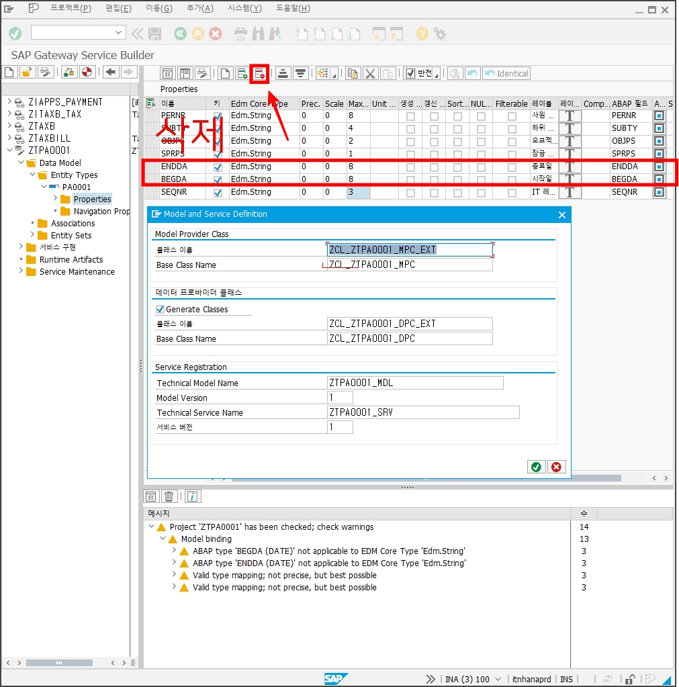
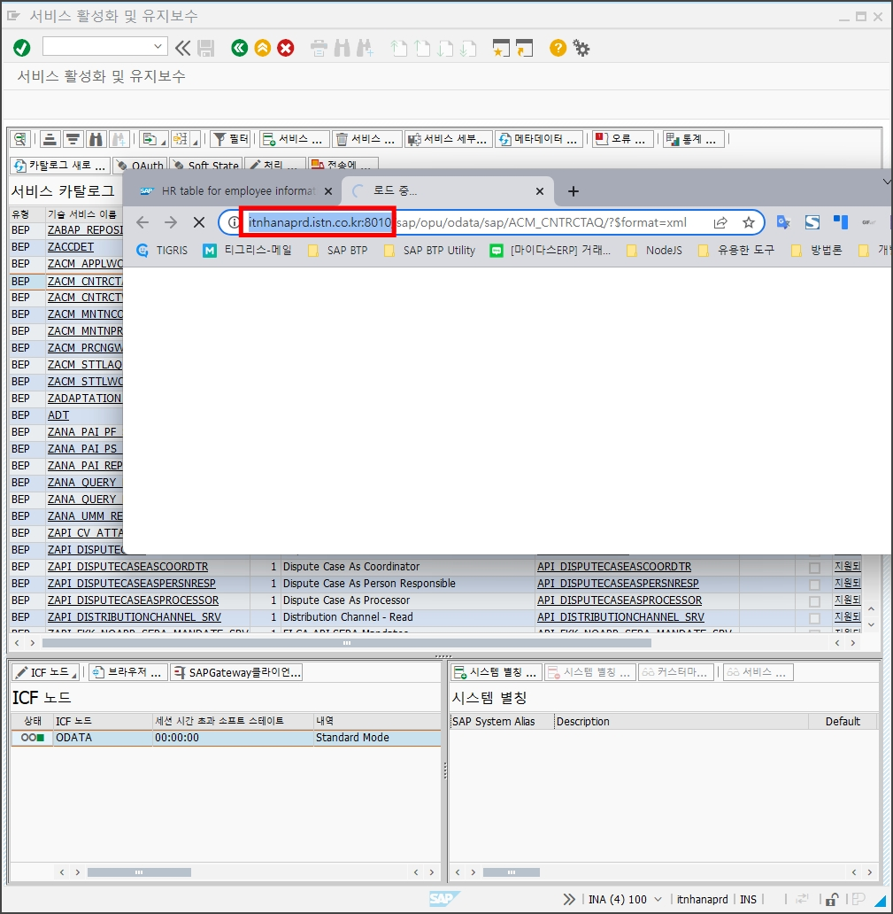

# **SAP BTP Onpremise Extension Tutotial_221126**

> 이 튜토리얼은 SAP BTP에서 SAP Onpremise OData를 통한 개발 방법을 설명합니다.
>
> 해당 프로젝트는 BTP Tutorial의 mta-hkmc를 기반으로 합니다.

## 1. Architecture Overview
다음은 애플리케이션의 전체 아키텍처를 나타내는 다이어그램입니다.

Destination 사용하여 Onpremise 에서 OData API를 통해 정보를 읽고 직원의 엔터티를 이용하는 Application입니다.


## 2. Onpremise OData 생성

1. **SAPGUI > SE11 > TABLE > PA0001**
2. HR 마스터 테이블을 참조해 OData를 생성하겠습니다.


3. **`Tcode: SEGW` > 신규 OData 서비스 생성**


4. **로컬오브젝트 생성**


5. **생성한 서비스 > Data Model > Import > DDIC Structure 선택**


6. **ENTITY명 `PA0001`  > Next**



7. **Structure에서 모든 필드를 선택 > Next**


8. **모든 필드 Key선택, Label은 ABAP NAME과 같이 대문자로 통일**


9. **ENDDA, BEGDA필드를 삭제**



10. **Generate > Confirm 선택**


11. **로컬오브젝트 생성**


12. **`이제 서비스`**


13. **`이제 서비스`**


14. **`GET_ENTITYSET 작성해 PA0001 테이블의 데이터를 OData를 통해 노출시킵니다.`**


15. **`Tcode: /IWFND/MAINT_SERVICE` > Service Catalog 목록에서 서비스 하나를 선택> > 브라우저 열기 선택**


16. **브라우저에서 SAP Gateway의 Host를 확인**
SAP BTP에서 OData를 호출시 Destiantion에 등록하여 사용합니다.
itnhanaprd.istn.co.kr:8010 해당 서버는 예시이므로 실제 호출 주소는 사용하시는 서버의 아래의 방법을 통해 Host를 직접 확인하셔야 합니다.



17. 실제 OData를 브라우저를 통해 호출한 모습입니다. 이제 이 OData를 SAP BTP Application을 만들어보겠습니다.

>| 전체 주소    | http://sems.istn.co.kr:8010/sap/opu/odata/SAP/ZTPA0001_SRV/PA0001Set |
>| ------------ | ------------------------------------------------------------ |
>| HOST         | http://sems.istn.co.kr:8010/                                 |
>| ODATA URI    | /sap/opu/odata/SAP/                                          |
>| Service Name | ZTPA0001_SRV                                                 |
>| Entity Name  | PA0001Set                                                    |
>|              |                                                              |


## 3. Application Configuration

> 이 튜토리얼은 이전에 생성한 `mta-hkmc`를 기반으로 합니다.
>
> 만약 프로젝트가 생성되어 있지 않다면, 이전 튜토리얼을 먼저 진행하시기 바랍니다.
>
> 앱을 실행하기 전에 우선적으로 설정해줘야하는 내역을 설명합니다.

### 1) Approuter Configuration

4. 이제 이전 튜토리얼에서 생성해둔 mta-hkmc 프로젝트로 이동하여 Approuter Destination을 작성합니다.
> #### SAP Approuter
>
> Application이 여러 개의 서로 다른 앱(마이크로서비스)으로 구성된 경우 Application Router는 해당 Application에 대한 단일 진입점(Single entry point)을 제공하는 데 Nodejs 기반의 라이브러리입니다.
>
> #### SAP Approuter를 사용할 수 있는 환경
>
> - SAP CF – Cloud Foundry
> - SAP XSA – XS Advanced (On Premise)
> - Local environment
>
> #### 주요기능
>
> - Dispatching of requests to other microservices
> - Authentication
> - Authorization check
> - Complete integration with Destination service
> - Complete integration with HTML5 Application repository
> - Complete integration with Business Services

5. **/mta-hkmc/mta-hkmc-approuter** 경로에서 **default-env.json** 파일을 생성하여 destination을 작성합니다. url을 호출시 name으로 대체하여 url을 호출합니다.

#### default-env.json
```json
{
    "destinations": [
        {
            "url": "https://sandbox.api.sap.com",
            "name": "sfsf_sandbox"
        },
        {
            "url": "http://sems.istn.co.kr:8010/",
            "name": "onpremise"
        }
    ]
}
```

6. **/mta-hkmc/mta-hkmc-approuter** 경로에서 **xs-app.json**과 **xs-app-local.jso** 파일을 수정합니다.

#### xs-app.json

```json
{
  "welcomeFile": "comhkmctrialztmp001/index.html",
  "authenticationMethod": "none",
  "routes": [
    {
      "source": "^/onpremise/(.*)$",
      "target": "$1",
      "destination": "onpremise",
      "csrfProtection": false
    },
    {
      "source": "^/onpremise/(.*)$",
      "target": "$1",
      "destination": "onpremise",
      "csrfProtection": false
    }
  ]
}
```


#### xs-app-local.json

```json
{
    "welcomeFile": "comhkmctrialztmp001/index.html",
    "authenticationMethod": "none",
    "routes": [
      {
        "source": "^/comhkmctrialztmp001/(.*)$",
        "target": "$1",
        "localDir": "../ztmp_001/webapp"
      },
      {
        "source": "^/sfsf_sandbox/(.*)$",
        "target": "$1",
        "destination": "sfsf_sandbox",
        "csrfProtection": false
      },
      {
        "source": "^/onpremise/(.*)$",
        "target": "$1",
        "destination": "onpremise",
        "csrfProtection": false
      }
    ]
  }
```


## 4. SAPUI5 Application 작성
> 이제 OData API를 호출해 SAPUI5 Table Component에 데이터를 바인딩해서 출력해보겠습니다.

**/mta-hkmc/ztmp_001/webapp/controller** 경로에서 main.controller.js 파일을 수정합니다.

#### main.controller.js

```javascript
sap.ui.define([
    "sap/ui/core/mvc/Controller",
    "sap/ui/model/json/JSONModel",
],
    /**
     * @param {typeof sap.ui.core.mvc.Controller} Controller
     */
    function (Controller, JSONModel) {
        "use strict";

        return Controller.extend("com.hkmc.trial.ztmp001.controller.Main", {
            onInit: function () {
                this._getEmployeeInfo();
                this._getUsersInfo();
            },

            _getEmployeeInfo: function() {
                var view = this.getView();
                var options = {
                    url: "/sfsf_sandbox/successfactors/odata/v2/PerEmergencyContacts",
                    method: "get",
                    headers: {
                        "APIKey": "jzS6mZfacFXArH27IpmNO3CYzDHF1oq0",
                        "Accept": "application/json"
                    }
                }
                $.ajax(options).then(function(res) {
                    view.setModel(new JSONModel(res.d.results), "PerEmergencyContacts");
                });
            },

            _getUsersInfo: function() {
                var view = this.getView();
                var textAuthorization = "<sapid>:<password>"; // 접속 ID/PW를 입력
                console.log(textAuthorization);
                var encodeAutorization = btoa(textAuthorization);
                console.log(encodeAutorization);
                var options = {
                    url: "/onpremise/sap/opu/odata/SAP/ZTPA0001_SRV/PA0001Set",
                    method: "get",
                    headers: {
                        "Authorization": "Basic " + encodeAutorization,
                        "Accept": "application/json"
                    }
                }
                $.ajax(options).then(function(res) {
                    view.setModel(new JSONModel(res.d.results), "Users");
                });
            }
        });
    });

```

> ajax 호출을 통해 API 호출합니다. URL 호출에 Destination에서 설정한 name으로 호출시 Destination에 설정된 url을 호출하게 됩니다.
> Onpremise에서 OData를 통해 데이터를 호출시 BasicAuth를 통해 OData에 접근합니다. 
> `_getUsersInfo`는 Onpremise에서 OData를 호출해 view에 모델을 바인딩하는 함수입니다.

**/mta-hkmc/ztmp_001/webapp/view** 경로에서 main.view.xml 파일을 수정합니다.

#### main.view.xml

```xml
<mvc:View 
    controllerName="com.hkmc.trial.ztmp001.controller.Main" 
    xmlns:mvc="sap.ui.core.mvc" 
    xmlns:ui="sap.ui.table" 
    displayBlock="true" 
    xmlns="sap.m" >
    <Page title="employee">
        <content>
            <ui:Table 
                id="id-tableTxwa" 
                visibleRowCount="10" 
                rows="{
                    path: 'PerEmergencyContacts>/',
                    sorter: [],
                    templateShareable : false
                }" selectionMode="MultiToggle" ariaLabelledBy="title">
                <ui:extension>
                    <OverflowToolbar>
                        <Text text="Employee"/>
                    </OverflowToolbar>
                </ui:extension>
                <ui:columns>
                    <ui:Column hAlign="Center" autoResizable="true">
                        <Label text="personIdExternal" />
                        <ui:template>
                            <Text text="{PerEmergencyContacts>personIdExternal}"/>
                        </ui:template>
                    </ui:Column>
                    <ui:Column hAlign="Center" autoResizable="true">
                        <Label text="name" />
                        <ui:template>
                            <Text text="{PerEmergencyContacts>name}"/>
                        </ui:template>
                    </ui:Column>
                    <ui:Column hAlign="Center" autoResizable="true">
                        <Label text="phone" />
                        <ui:template>
                            <Text text="{PerEmergencyContacts>phone}"/>
                        </ui:template>
                    </ui:Column>
                    <ui:Column hAlign="Center" autoResizable="true">
                        <Label text="email" />
                        <ui:template>
                            <Text text="{PerEmergencyContacts>email}"/>
                        </ui:template>
                    </ui:Column>
                </ui:columns>
            </ui:Table>

            <ui:Table 
                id="id-tableUsers" 
                visibleRowCount="10" 
                rows="{
                    path: 'Users>/',
                    sorter: [],
                    templateShareable : false
                }" selectionMode="MultiToggle" ariaLabelledBy="title">
                <ui:extension>
                    <OverflowToolbar>
                        <Text text="User"/>
                    </OverflowToolbar>
                </ui:extension>
                <ui:columns>
                    <ui:Column hAlign="Center" autoResizable="true">
                        <Label text="PERNR" />
                        <ui:template>
                            <Text text="{Users>PERNR}"/>
                        </ui:template>
                    </ui:Column>
                    <ui:Column hAlign="Center" autoResizable="true">
                        <Label text="SUBTY" />
                        <ui:template>
                            <Text text="{Users>SUBTY}"/>
                        </ui:template>
                    </ui:Column>
                    <ui:Column hAlign="Center" autoResizable="true">
                        <Label text="OBJPS" />
                        <ui:template>
                            <Text text="{Users>OBJPS}"/>
                        </ui:template>
                    </ui:Column>
                    <ui:Column hAlign="Center" autoResizable="true">
                        <Label text="SPRPS" />
                        <ui:template>
                            <Text text="{Users>SPRPS}"/>
                        </ui:template>
                    </ui:Column>
                    <ui:Column hAlign="Center" autoResizable="true">
                        <Label text="SEQNR" />
                        <ui:template>
                            <Text text="{Users>SEQNR}"/>
                        </ui:template>
                    </ui:Column>
                </ui:columns>
            </ui:Table>
        </content>
    </Page>
</mvc:View>

```

## 최종 결과


여기까지 SAP SFSF API통한 Side-by-Side Extension에 대한 기본적인 개발 방법에 알아봤습니다.

해당 상세 소스는 아래의 git를 통해 확인하실 수 있습니다.

#### https://github.com/rendez0829/mta-hkmc-onpremise